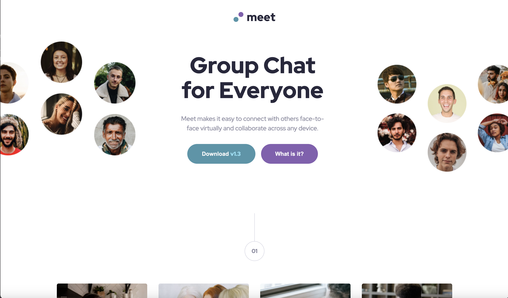

# Frontend Mentor - Testimonials grid section solution

This is a solution to the [Testimonials grid section challenge on Frontend Mentor](https://www.frontendmentor.io/challenges/testimonials-grid-section-Nnw6J7Un7). Frontend Mentor challenges help you improve your coding skills by building realistic projects.

## Table of contents

- [The challenge](#the-challenge)
- [Screenshot](#screenshot)
- [Links](#links)
- [Built with](#built-with)
- [What I learned](#what-i-learned)

## Overview

### The challenge

Users should be able to:

- View the optimal layout for the site depending on their device's screen size

### Screenshot

### Links

- Solution URL: [https://github.com/tunaerten/landing-page]
- Live Site URL: [https://landing-page-erten.netlify.app/]

## My process

### Built with

- Semantic HTML5 markup
- CSS custom properties
- Flexbox
- CSS Grid
- Mobile-first workflow

### What I learned

It wasn't a very challenging project, but it was quite fun. I started with the mobile design first. I think next time, even if I begin with the mobile design, I'll organize the components with the desktop design in mind. I'll design each section (mobile, tablet, desktop) not separately but as a whole.

I had quite a hard time adjusting images for different screen sizes. I had to do a lot of research, especially between the hero image on large screens and tablets. When I first wrote the code, I didn't use the picture tag, but I later changed the hero section. Next time, I’ll plan the images for different screen sizes better from the start.

The last change I made before publishing the page was adjusting the heading font size according to the page size. I used clamp for this. I'm not sure if it's the ideal ap proach. I achieved the result I wanted, but I'm open to your advice on this.
